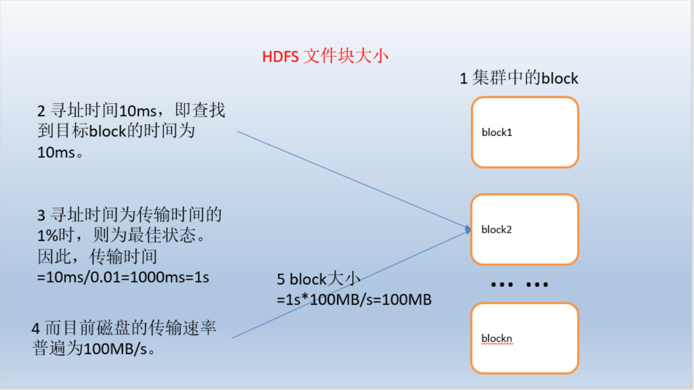

#### 1、概念
HDFS，是一个分布式文件系统，全称：Hadoop Distributed File System，用于存储文件，通过目录树来定位文件。
#### 2、组成
- HDFS集群包括，NameNode和DataNode以及Secondary Namenode。
- NameNode负责管理整个文件系统的元数据，以及每一个路径（文件）所对应的数据块信息。
- DataNode 负责管理用户的文件数据块，每一个数据块都可以在多个datanode上存储多个副本。
- Secondary NameNode用来监控HDFS状态的辅助后台程序，每隔一段时间获取HDFS元数据的快照。
#### 3、HDFS 文件块大小
可通过 dfs.blocksize参数设置。HDFS的块比磁盘的块大，其目的是为了最小化寻址开销，多个块组成的文件的时间取决于磁盘传输速率。
