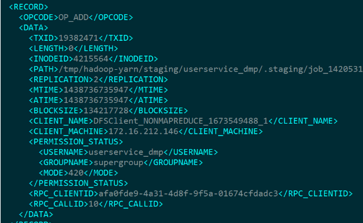

- oiv查看fsimage文件
hdfs oiv -p XML -i fsimage_0000000000000000316 -o /opt/fsimage.xml

- oev查看edits文件(类型：binary，XML(默认), stats)
hdfs oev -p XML -i edits_0000000000000000135-0000000000000000135 -o /opt/module/hadoop-2.8.4/edits.xml -p stats

- 滚动编辑日志
hdfs dfsadmin -rollEdits
正常情况HDFS文件系统有更新操作时，就会滚动编辑日志。也可以用命令强制滚动编辑日志。
镜像文件产生时间：Namenode启动时加载镜像文件和编辑日志

#### edits文件信息

每个RECORD记录了一次操作，比如图中的
OP_ADD代表添加文件操作、OP_MKDIR代表创建目录操作。里面还记录了
文件路径（PATH）
修改时间（MTIME）
添加时间（ATIME）
客户端名称（CLIENT_NAME）
客户端地址（CLIENT_MACHINE）
权限（PERMISSION_STATUS）等非常有用的信息

#### namenode发生故障，使用SecondaryNameNode恢复的方法
- 方法一：将SecondaryNameNode中数据拷贝到namenode存储数据的目录
- 方法二：修改hdfs-site.xml中dfs.namenode.checkpoint.period，dfs.namenode.name.dir，导入检查点文件，hdfs namenode -importCheckpoint

注意：
- 如果SecondaryNameNode不和Namenode在一个主机节点上，需要将SecondaryNameNode存储数据的目录拷贝到Namenode存储数据的平级目录
- 如果提示文件锁了，可以删除in_use.lock 

#### Namenode多目录配置
思考1：如果在非Namenode节点、进行格式化(hdfs namenode -format)
是否和在NN节点上同样会生成name1和name2目录呢？

    答：只要配置了以上得配置，在该节点下同样会生成name1和name2
       具体解释：
            格式化做了哪些事情？
            在NameNode节点上，有两个最重要的路径，分别被用来存储元数据信息和操作日志，而这两个路径来自于配置文件，它们对应的属性分别是dfs.name.dir和dfs.name.edits.dir，
            同时，它们默认的路径均是/tmp/hadoop/dfs/name。格式化时，NameNode会清空两个目录下的所有文件，之后，格式化会在目录dfs.name.dir下创建文件
            hadoop.tmp.dir 这个配置，会让dfs.name.dir和dfs.name.edits.dir会让两个目录的文件生成在一个目录里

思考2：非NN上如果生成了name1和name2，那么他和NN上生成得有没有差别？

    答：有区别、NN点上会产生新得edits_XXX，非NN不会fsimage会更新，而非NN不会，只会产生一个仅初始化得到得fsimage，不会生成edits,更不会发生日志滚动。节