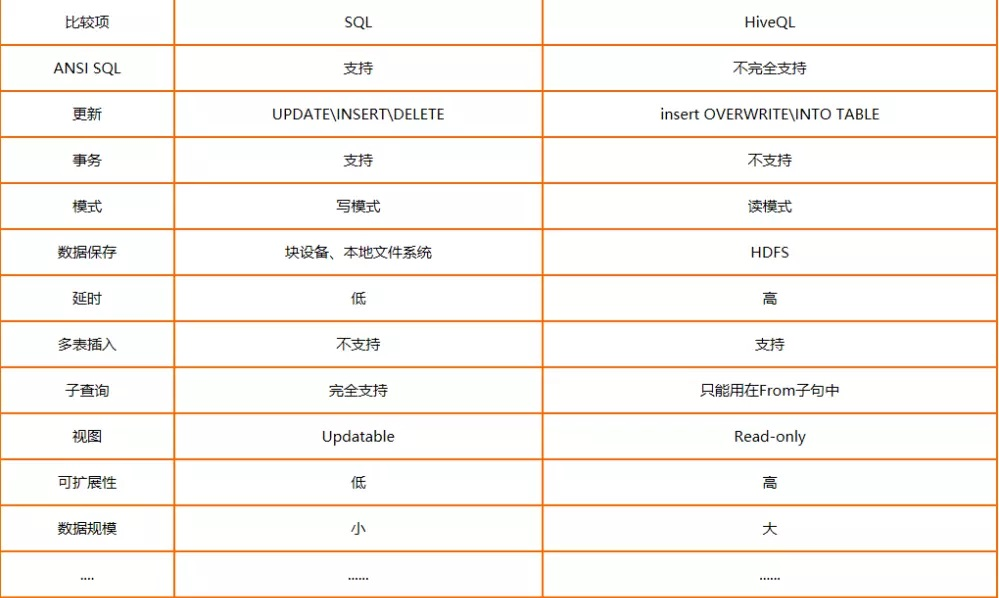
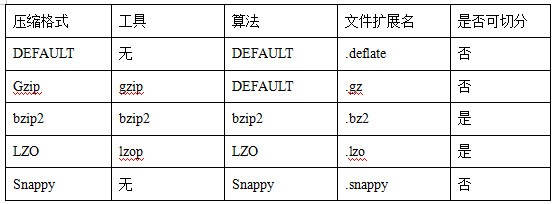
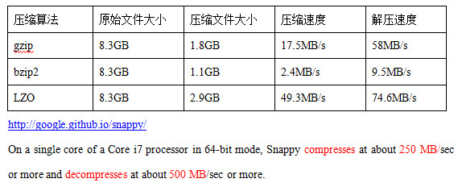
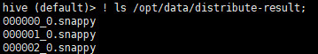
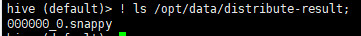
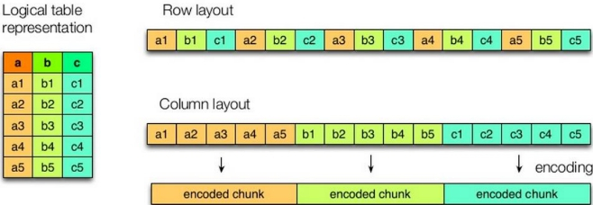
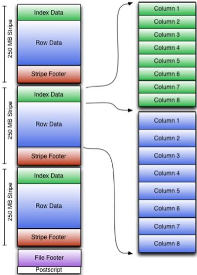
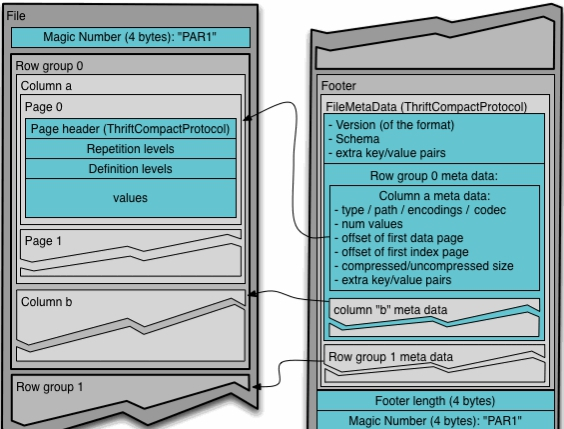

### 一、Hive基本概念
1. 什么是Hive
    ~~~
    Hive是基于Hadoop的一个数据仓库工具，可以将结构化的数据文件映射为一张表，并提供类SQL查询功能。
    本质是将HQL/SQL转换为MapReduce程序。
        1）Hive处理的数据存储在HDFS
        2）Hive分析数据底层的实现是MapReduce
        3)执行程序运行在Yarn上

1. Hive的优缺点
     ~~~
    优点：
        1）操作接口采用类SQL语法，避免写MapReduce
        2）支持用户自定义函数
        3）优势在于处理大数据，进行离线数据分析，因为Hive的执行延迟比较高
    缺点：
        1）HQL表达能力有限，无法表达迭代式算法，不擅长数据挖掘方面
        2）效率比较低，自动生成的MapReduce Job通常不够智能化，调优比较困难，粗度较大

1. Hive架构原理

   
     ~~~
    组成及作用：
        用户接口：ClientCLI（hive shell）、JDBC/ODBC(java访问hive)、WEBUI（浏览器访问hive）
        
        元数据(Metastore)：包括表名、表所属的数据库（默认是default）、表的拥有者、列/分区字段、表的类型（是否是外部表）、表的数据所在目录等；默认存储在自带的derby数据库中，推荐使用MySQL存储Metastore
        Hadoop：使用HDFS进行存储，使用MapReduce进行计算
        
        驱动器（Driver）：
        （1）解析器（SQL Parser）：将SQL字符串转换成抽象语法树AST，这一步一般都用第三方工具库完成，比如antlr；对AST进行语法分析，比如表是否存在、字段是否存在、SQL语义是否有误。
        （2）编译器（Physical Plan）：将AST编译生成逻辑执行计划。
        （3）优化器（Query Optimizer）：对逻辑执行计划进行优化。
        （4）执行器（Execution）：把逻辑执行计划转换成可以运行的物理计划。对于Hive来说，就是MR/Spark。

    工作原理：
        用户创建数据库、表信息，存储在hive的元数据库中；
        向表中加载数据，元数据记录hdfs文件路径与表之间的映射关系；
        执行查询语句，首先经过解析器、编译器、优化器、执行器，将指令翻译成MapReduce，提交到Yarn上执行，最后将执行返回的结果输出到用户交互接口。

1. Hive和传统关系型数据库(RMDB)比较

   
     ~~~
    数据库的事务、索引以及更新都是传统数据库的重要特性。但是Hive到目前也不支持更新（这里说的是对行级别的数据进行更新），不支持事务；
    虽然Hive支持建立索引，但是它还不能提升数据的查询速度：

1. 参数配置方式
     ~~~
    1)配置文件
        优先级：Hadoop配置 < 默认配置hive-default.xml < 用户自定义配置hive-site.xml ;
        配置文件的设定对本机启动的所有Hive进程都有效。
    2）命令行参数
        bin/hive -hiveconf mapred.reduce.tasks=10;
        仅对本次hive启动有效。
    3）参数声明
        hive (default)> set mapred.reduce.tasks=10;
        仅对本次hive启动有效
        
     注：
        查看配置信息：
            hive>set;
            hive (default)> set mapred.reduce.tasks;
        
        上述三种设定方式的优先级依次递增,即配置文件<命令行参数<参数声明。
        注意某些系统级的参数，例如log4j相关的设定，必须用前两种方式设定，因为那些参数的读取在会话建立以前已经完成了。

1. Hive数据类型
     ~~~
    基本类型：TINYINT、SMALINT、INT、BIGINT、BOOLEAN、FLOAT、DOUBLE、STRING、TIMESTAMP、BINARY
    集合类型：STRUCT、MAP、ARRAY
    
    类型转化：
        1）隐式类型转换：
            a.任何整数类型都可以隐式地转换为一个范围更广的类型
            b.所有整数类型、FLOAT和STRING类型都可以隐式地转换成DOUBLE
            c.TINYINT、SMALLINT、INT都可以转换为FLOAT
            d.BOOLEAN类型不可以转换为任何其它的类型
        2)CAST显示转换：
            // a为binary（字节数组），a代表数字时
            // 如果强制类型转换失败，表达式返回空值 NULL
            SELECT (cast(cast(a as string) as double)) from src;
      
1. 实操：导入文件数据到表中
    ~~~
    样例json:
        {
            "name": "songsong",
            "friends": ["bingbing" , "lili"] ,       //列表Array, 
            "children": {                      //键值Map,
                "xiao song": 18 ,
                "xiaoxiao song": 17  
          }
            "address": {                      //结构Struct,
                "street": "hai dian qu" ,
                "city": "beijing" 
            }
        }
    
    样例文本：
        songsong,bingbing_lili,xiao song:18_xiaoxiao song:17,hai dian qu_beijing
        yangyang,caicai_susu,xiao yang:18_xiaoxiao yang:19,chao yang_beijing 
    
    1）建表HQL
        create table test(
            name string,
            friends array<string>,
            children map<string, int>,
            address struct<street:string, city:string>
        )
        row format delimited fields terminated by ','
        collection items terminated by '_'
        map keys terminated by ':'
        lines terminated by '\n';
        
    2）导入数据
        hive (default)> load data local inpath '/test.txt' into table test;
        
    3）访问集合中的数据，以下分别是ARRAY，MAP，STRUCT的访问方式
        hive (default)> select friends[1]as`朋友`,children['xiao song']as`年龄`,address.city from test where name="songsong";
        
### 二、DDL数据定义
   数据库模式定义语言DDL(Data Definition Language)，是用于描述数据库中要存储的现实世界实体的语言。
   1. 数据库操作
        ~~~
        1)创建数据库
            hive (default)> create database if not exists db_hive location '/db_hive.db';
            hive> desc database extended db_hive;
            
        2）修改数据库
            hive (default)> alter database db_hive set dbproperties('createtime'='20190506');
            // 数据库的其他元数据信息都是不可更改的，包括数据库名和数据库所在的目录位置。
            
        3）查看数据库
            hive> show databases like 'db_hive*';
            
        4)删除数据库
            hive> drop database if exists db_hive cascade; 
   
   1. 表操作
        ~~~
        1）表的类型
           Table Type: MANAGED_TABLE、EXTERNAL_TABLE
           管理表（内部表）：
               默认创建的表就是管理表，当我们删除一个管理表时，Hive也会删除这个表中数据。管理表不适合和其他工具共享数据。
           外部表：
               删除该表并不会删除掉这份数据，不过描述表的元数据信息会被删除掉。  
        
        2）创建表
            a.普通创建表
                create (external) table if not exists student2(id int, name string)
                row format delimited fields terminated by '\t'
                stored as textfile
                location '/user/hive/warehouse/student2';
                
            b.根据查询结果创建表（查询的结果会添加到新创建的表中）
                create table if not exists student3 as select id, name from student;
                // 这种方式不能创建外部表
            
            c.根据已经存在的表结构创建表
                create (external) table if not exists student4 like student;       
   
        3）修改表
            a.重命名
                alter table student2 rename to student1;
            b.添加列
                 alter table student1 add columns(desc string);
                 // ADD是代表新增一字段，字段位置在所有列后面(partition列前)
            c.更新列
                 alter table student1 change column desc addr string;
            d.替换列
                alter table student1 replace columns(id int, name string);
                // REPLACE则是表示替换表中所有字段
        
        4）删除表
            drop table if exists student1;
   
   1. 分区表
        ~~~
        分区表实际上就是对应一个HDFS文件系统上的独立的文件夹，该文件夹下是该分区所有的数据文件。
        在查询时通过WHERE子句中的表达式选择查询所需要的指定的分区，这样的查询效率会提高很多。
        
        1）创建分区表
            create table dept_partition(
                deptno int, dname string, loc string
            )
            // 二级分区表
            partitioned by (month string, day string)
            row format delimited fields terminated by '\t';
        
        2）查询分区表中数据
            // 单分区查询
            select * from dept_partition where month='201911' and  day='11';    
            
            // 多分区联合查询
            select * from dept_partition where month='201908'
            union
            select * from dept_partition where month='201907'
            union
            select * from dept_partition where month='201909';
        
        3）增加分区
            alter table dept_partition add partition(month='201905') partition(month='201904');
            // 增加多个分区之间用空格" "隔开，删除多个分区用","隔开
       
        4）删除分区
            alter table dept_partition drop partition (month='201905'), partition (month='201904');
        
        5）查看分区
            show partitions dept_partition;
  
        6）把数据直接上传到分区目录上，让分区表和数据产生关联的两种方式
            a.上传数据后修复
                dfs -mkdir -p /hive/dept_partition/month=201911/day=11;
                dfs -put /dept.txt /hive/dept_partition/month=201911/day=11;
                // 修复命令
                msck repair table dept_partition;
                
            b.上传数据后添加分区
                dfs -mkdir -p /hive/dept_partition/month=201911/day=12;
                dfs -put /dept.txt /hive/dept_partition/month=201911/day=12;
                // 执行添加分区
                alter table dept_partition add partition(month='201911', day='12');
            
            c.上传数据后load数据到分区
                dfs -mkdir -p /hive/dept_partition/month=201911/day=13;
                load data local inpath '/dept.txt' into table dept_partition partition(month='201911',day='13');

### 三、DML数据操作
   1. 数据导入
        ~~~
        1）向表中装载数据（Load）
            load data  (local) inpath '/hive/student.txt' overwrite into table default.student;
            // load hdfs的数据相当于mv文件到另一个目录中，原目录文件消失
            
        2）通过查询语句向表中插入数据（Insert）
             // 基本模式插入（根据单张表查询结果）
             insert overwrite table student partition(month='201908')
                select id, name from student where month='201907';
             
             // 多插入模式（根据多张表查询结果）
             from student
                insert overwrite table student partition(month='201909')
                    select id, name where month='201907'
                insert overwrite table student partition(month='201910')
                    select id, name where month='201908';
                    
        3）查询语句中创建表并加载数据（As Select）
            create table if not exists student3
                as select id, name from student;
            // 这种方式不能创建外部表,CREATE-TABLE-AS-SELECT cannot create external table
        
        4)创建表时通过Location指定加载数据路径
            create table if not exists student5(
                            id int, name string
                          )
                          row format delimited fields terminated by '\t'
                          location '/hive/student5';
                          
            dfs -put /student.txt  /hive/student5;
            
        5)Import数据到指定Hive表中
            // 先用export导出后（导出的数据目录里面附带有元数据)，再import数据导入。
            // import导入的表中不能存在数据，FAILED: SemanticException [Error 10119]: Table exists and contains data files
            export table default.student to '/hive/export/student';
            
            create table student5(
               id int, name string
            )
            partitioned by (month string)
            row format delimited fields terminated by '\t';
            
            import table student5 from '/hive/export/student';
            
   1. 数据导出
        ~~~
        1)Insert导出
            a.将查询的结果导出到本地,数据之间无间隔
                insert overwrite local directory '/hive/student2'
                            select * from student;
                            
            b.将查询的结果格式化导出到本地,数据之间"\t"间隔
                insert overwrite local directory '/hive/student2'
                     row format delimited fields terminated by '\t'
                     select * from student;
                     
            c.将查询的结果导出到HDFS上(没有local)
                insert overwrite directory '/hive/student2'
                     row format delimited fields terminated by '\t'
                     select * from student;
                     
        2) Hadoop命令导出到本地
            dfs -get /hive/student  ./data/export/student3.txt;
        
        3)Hive Shell 命令导出到本地
            bin/hive -f ./data/student.sql > ./data/student.txt
            
        4)Export导出到HDFS上
            export table default.student to '/hive/export/student';
        
        5)Sqoop导出

   1. 清除表中数据（Truncate）
        ~~~
        // Truncate只能删除管理表，不能删除外部表中数据
        truncate table student;
        
### 四、查询
1. Where语句
    ~~~
    1)Like和RLike
        % 代表零个或多个字符(任意个字符)。
        _ 代表一个字符。
        RLIKE子句是Hive中这个功能的一个扩展，其可以通过Java的正则表达式这个更强大的语言来指定匹配条件。
        
        例：
            // 查找以2开头薪水的员工信息
            select * from emp where sal LIKE '2%';
            
            // 查找第二个数值为2的薪水的员工信息
            select * from emp where sal LIKE '_2%';
            
            //查找薪水中含有2的员工信息
            select * from emp where sal RLIKE '[2]';

1. 分组
    ~~~
    1)Group By语句
        // 计算emp每个部门中每个岗位的最高薪水
        select t.deptno, t.job, max(t.sal) max_sal from emp t group by t.deptno, t.job;
    
    2)Having语句
        // 求每个部门的平均薪水大于2000的部门
         select deptno, avg(sal) avg_sal from emp group by deptno having avg_sal > 2000;
    
    3)having与where不同点
        a.where针对表中的列发挥作用，查询数据；having针对查询结果中的列发挥作用，筛选数据。
        b.where后面不能写分组函数，而having后面可以使用分组函数。
        c.having只用于group by分组统计语句。
        
 1. Join语句
    ~~~
    1)等值Join
        // Hive只支持等值连接，不支持非等值连接。
        select e.empno, e.ename, d.deptno, d.dname from emp e join dept d on e.deptno = d.deptno;
        select e.empno,e.ename,d.deptno,d.dname from emp e,dept d where e.deptno=d.deptno;     
        
    2)内连接
        // 只有进行连接的两个表中都存在与连接条件相匹配的数据才会被保留下来
        select e.empno, e.ename, d.deptno from emp e join dept d on e.deptno = d.deptno;
    
    3)左外连接
        // JOIN操作符左边表中符合WHERE子句的所有记录将会被返回
        select e.empno, e.ename, d.deptno from emp e left join dept d on e.deptno = d.deptno;
         
    4)右外连接
        // JOIN操作符右边表中符合WHERE子句的所有记录将会被返回。
        select e.empno, e.ename, d.deptno from emp e right join dept d on e.deptno = d.deptno;
        
    5)满外连接
        // 将会返回所有表中符合WHERE语句条件的所有记录。
        // 如果任一表的指定字段没有符合条件的值的话，那么就使用NULL值替代
        select e.empno, e.ename, d.deptno from emp e full join dept d on e.deptno = d.deptno;
        
    6)多表连接
        // 连接 n个表，至少需要n-1个连接条件,Hive总是按照从左到右的顺序执行的
        SELECT e.ename, d.deptno, l. loc_name
        FROM   emp e 
        JOIN   dept d
        ON     d.deptno = e.deptno 
        JOIN   location l
        ON     d.loc = l.loc;
        
    7)笛卡尔积
        a.以下情况会产生笛卡尔积
            省略连接条件
            连接条件无效
            所有表中的所有行互相连接
        select * from emp, dept;
            
    8)连接谓词中不支持or
        // 错误的
        select e.empno, e.ename, d.deptno from emp e join dept d on e.deptno = d.deptno or e.ename=d.ename;

 1. 排序
    ~~~
    1）按照别名排序
         select ename, sal*2 twosal from emp order by twosal;
     
    2）每个MapReduce内部排序（Sort By）
        // Sort By：每个MapReduce内部进行排序，分区规则按照key的hash来运算，（区内排序）对全局结果集来说不是排序。
        set mapreduce.job.reduces=3;
        select * from emp sort by empno desc;
    
    3)分区排序（Distribute By）
        // Distribute By：类似MR中partition，进行分区，结合sort by使用。
        // Hive要求DISTRIBUTE BY语句要写在SORT BY语句之前。
        set mapreduce.job.reduces=3;
        select * from emp distribute by deptno sort by empno desc;
        
    4)Cluster By
        // 当distribute by和sorts by字段相同时，可以使用cluster by方式，但是只能是倒序排序
        select * from emp cluster by deptno;
        
        注：按照部门编号分区，不一定就是固定死的数值，可以是20号和30号部门分到一个分区里面去。

 1. 分桶及抽样查询
    ~~~
    1）分桶表数据存储
        分区针对的是数据的存储路径；分桶针对的是数据文件，将数据集分解成更容易管理的若干部分。
        
        a.创建分桶表
            create table stu_buck1(id int, name string)
            clustered by(id) into 4 buckets
            row format delimited fields terminated by '\t';
        
        b.设置属性
             set hive.enforce.bucketing=true;
             set mapreduce.job.reduces=-1;
        
        c.导入数据到分桶表，通过子查询的方式
            insert into table stu_buck
            select id, name from stu;
            
    2)分桶抽样查询
        // tablesample(bucket x out of y)
        // x表示从哪个bucket开始抽取,x的值必须小于等于y的值,否则FAILED: SemanticException [Error 10061]: Numerator should not be bigger than denominator in sample clause for table stu_buck
        // y的大小，决定抽样的比例，不是桶数的倍数或者因子也可以，但是不推荐。
        select * from stu_buck tablesample(bucket 1 out of 4 on id);
    
    3)数据块抽样
        基于行数,按照输入路径下的数据块百分比进行抽样
        select * from student tablesample(0.1 percent) ;
        
        提示：
            a.这种抽样方式不一定适用于所有的文件格式。
            b.另外，这种抽样的最小抽样单元是一个HDFS数据块。因此，如果表的数据大小小于普通的块大小128M的话，那么将会返回所有行。

### 五、函数
1. 系统函数
    ~~~
    1）查看系统自带的函数
        show functions;
        
    2）显示自带的函数的用法
        desc function upper;
        
    3）详细显示自带的函数的用法
        desc function extended upper;
    
2. 自定义函数

    用户自定义函数（UDF：user-defined function）
    ~~~
    1)UDF类别
        a.UDF（User-Defined-Function）
            一进一出
            
        b.UDAF（User-Defined Aggregation Function）
            聚集函数，多进一出
            类似于：count/max/min
            
        c.UDTF（User-Defined Table-Generating Functions）
            一进多出
            如lateral view explore()
            
    2)编程步骤
        a.继承org.apache.hadoop.hive.ql.UDF
        
        b.需要实现evaluate函数；evaluate函数支持重载；
        
        c.在hive的命令行窗口创建函数
            ①添加jar
                add jar linux_jar_path
            ②创建function，
                create [temporary] function [dbname.]function_name AS class_name;
                例：create temporary function udf_lower as "com.itstar.hive.Lower";
        
        d.在hive的命令行窗口删除函数
            Drop [temporary] function [if exists] [dbname.]function_name;    
        
        注：UDF必须要有返回类型，可以返回null，但是返回类型不能为void
        
### 六、压缩和存储
1. MR支持的压缩编码
    
    1）支持的压缩格式
            
    
    2）压缩性能的比较
             

1. 开启Map输出阶段压缩

    开启map输出阶段压缩可以减少job中map和Reduce task间数据传输量
    ~~~
    1）开启hive中间传输数据压缩功能,默认为false
        set hive.exec.compress.intermediate=true;
        
    2）开启mapreduce中map输出压缩功能,默认为false
        set mapreduce.map.output.compress=true;
    
    3）设置mapreduce中map输出数据的压缩方式
    set mapreduce.map.output.compress.codec= org.apache.hadoop.io.compress.SnappyCodec;
    
    4）执行查询语句
         select count(ename) name from emp;

1. 开启Reduce输出阶段压缩
    ~~~
    set mapreduce.job.reduces=3;
    1）开启hive最终输出数据压缩功能,默认为false
        set hive.exec.compress.output=true;
    
    2）开启mapreduce最终输出数据压缩,默认为false
        set mapreduce.output.fileoutputformat.compress=true;
    
    3）设置mapreduce最终数据输出压缩方式
        set mapreduce.output.fileoutputformat.compress.codec = org.apache.hadoop.io.compress.SnappyCodec;
    
    4）设置mapreduce最终数据输出压缩为块压缩
        set mapreduce.output.fileoutputformat.compress.type=BLOCK;
    
    5）测试一下输出结果是否是压缩文件
        insert overwrite local directory '/opt/data/distribute-result' select * from emp distribute by deptno sort by empno desc;  
        
        测试:不设置reduce，结果是否是压缩格式
        hive (default)> set mapreduce.job.reduces=-1;
        insert overwrite local directory '/opt/data/distribute-result' select * from emp distribute by deptno sort by empno desc;  
    ~~~
    设置reduce为3的压缩结果
    
    

    不设置reduce的压缩结果
        
    
1. 文件存储格式

        
    ~~~
    1）存储格式
        行储存：textFile 、 sequencefile 、
        列储存：orc 、parquet
    
    2）行存储与列存储的特点    
        行存储的特点： 
            查询满足条件的一整行数据的时候，只需要找到其中一个值，其余的值都在相邻地方，所以此时行存储查询的速度更快。
        
        列存储的特点： 
            因为每个字段的数据聚集存储，在查询只需要少数几个字段的时候，能大大减少读取的数据量；
            每个字段的数据类型一定是相同的，列式存储可以更好的针对性的设计压缩算法。
    
    3）存储文件的对比
        压缩比：ORC >  Parquet >  textFile
        查询速度：查询速度相近。
    ~~~
    1）TextFile格式
    
        a.默认格式，数据不做压缩，磁盘开销大，数据解析开销大。
        b.可结合Gzip、Bzip2使用，但使用Gzip这种方式，hive不会对数据进行切分，从而无法对数据进行并行操作。
    
     2）Orc格式
     
    
    ~~~
    Orc (Optimized Row Columnar)，由1个或多个stripe组成，每个stripe250MB大小，相当于RowGroup的概念，应该能提升顺序读的吞吐率。
    每个Stripe里有三部分组成，分别是Index Data，Row Data，Stripe Footer
    
    1）Index Data
        一个轻量级的index，默认是每隔1W行做一个索引。这里做的索引应该只是记录某行的各字段在Row Data中的offset。
    2）Row Data
        存的是具体的数据，先取部分行，然后对这些行按列进行存储。对每个列进行了编码，分成多个Stream来存储。
    3）Stripe Footer
        存的是各个Stream的类型，长度等信息。
        
    4)File Footer
        存的是每个Stripe的行数，每个Column的数据类型信息等
    
    5)PostScript
        记录了整个文件的压缩类型以及FileFooter的长度信息等    
    
    注：
        在读取文件时，会seek到文件尾部读PostScript，从里面解析到File Footer长度，
        再读FileFooter，从里面解析到各个Stripe信息，
        再读各个Stripe，即从后往前读。
    ~~~  
    3）Parquet格式  
    
    Parquet文件是以二进制方式存储的，所以是不可以直接读取的，
    文件中包括该文件的数据和元数据，因此Parquet格式文件是自解析的。
     
    通常情况下，在存储Parquet数据的时候会按照Block大小设置行组的大小，
    由于一般情况下每一个Mapper任务处理数据的最小单位是一个Block，这样可以把每一个行组由一个Mapper任务处理，增大任务执行并行度。
    
    ~~~
    1)Magic Number
        文件的首尾都是该文件的Magic Code，用于校验它是否是一个Parquet文件
    
    2）Footer length
        记录了文件元数据的大小，通过该值和文件长度可以计算出元数据的偏移量
        文件的元数据中包括每一个行组的元数据信息和该文件存储数据的Schema信息
        除了文件中每一个行组的元数据，每一页的开始都会存储该页的元数据
        
    3)三种类型的页
        a.数据页
            存储当前行组中该列的值
        b.字典页
            存储该列值的编码字典，每一个列块中最多包含一个字典页
        c.索引页
            存储当前行组下该列的索引，目前Parquet中还不支持索引页

1. 存储和压缩结合
    
    1）查看hadoop支持的压缩方式
    ~~~
    hadoop checknative
    ~~~
    2）创建一个SNAPPY压缩的ORC存储方式
    
    ~~~
    create table log_orc_snappy(
        track_time string,
        url string,
        session_id string,
        referer string,
        ip string,
        end_user_id string,
        city_id string
    )
    row format delimited fields terminated by '\t'
    stored as orc tblproperties ("orc.compress"="SNAPPY");
    
    // 查看数据大小
    dfs -du -h /hive/log_orc_snappy/ ;
    
    // orc存储文件默认采用ZLIB压缩。比snappy压缩的小。
    ~~~
    
    3)hive表的数据存储方式和压缩总结
    ~~~
    存储格式: 一般选择orc或parquet
    压缩方式: 一般选择snappy，lzo
    ~~~
### Hive常用命令

1. “-e”不进入hive的交互窗口执行sql语句
   ~~~  
   bin/hive -e "select id from student;"
   
1. “-f”执行脚本中sql语句
     ~~~
     bin/hive -f ./data/student.sql > ./data/student.txt
     
     
