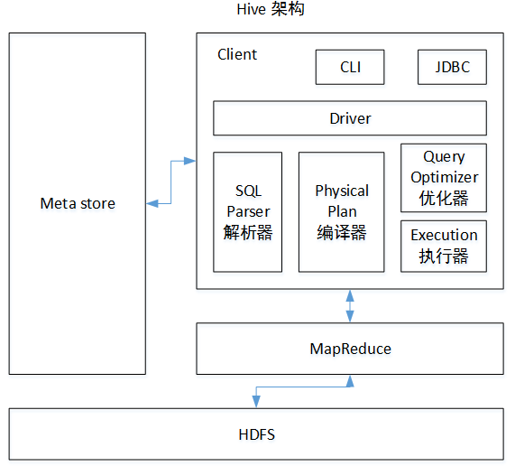

### 一、Hive基本概念
1、什么是Hive

    Hive是基于Hadoop的一个数据仓库工具，可以将结构化的数据文件映射为一张表，并提供类SQL查询功能。本质是将HQL/SQL转换为MapReduce程序。
    1）Hive处理的数据存储在HDFS
    2）Hive分析数据底层的实现是MapReduce
    3)执行程序运行在Yarn上

2、Hive的优缺点

    优点：
        1）操作接口采用类SQL语法，避免写MapReduce
        2）支持用户自定义函数
        3）优势在于处理大数据，进行离线数据分析，因为Hive的执行延迟比较高
    缺点：
        1）HQL表达能力有限，无法表达迭代式算法，不擅长数据挖掘方面
        2）效率比较低，自动生成的MapReduce Job通常不够智能化，调优比较困难，粗度较大

3、Hive架构原理

   
    
    组成及作用：
        用户接口：ClientCLI（hive shell）、JDBC/ODBC(java访问hive)、WEBUI（浏览器访问hive）
        
        元数据(Metastore)：包括表名、表所属的数据库（默认是default）、表的拥有者、列/分区字段、表的类型（是否是外部表）、表的数据所在目录等；默认存储在自带的derby数据库中，推荐使用MySQL存储Metastore
        Hadoop：使用HDFS进行存储，使用MapReduce进行计算
        
        驱动器（Driver）：
        （1）解析器（SQL Parser）：将SQL字符串转换成抽象语法树AST，这一步一般都用第三方工具库完成，比如antlr；对AST进行语法分析，比如表是否存在、字段是否存在、SQL语义是否有误。
        （2）编译器（Physical Plan）：将AST编译生成逻辑执行计划。
        （3）优化器（Query Optimizer）：对逻辑执行计划进行优化。
        （4）执行器（Execution）：把逻辑执行计划转换成可以运行的物理计划。对于Hive来说，就是MR/Spark。

    工作原理：
        用户创建数据库、表信息，存储在hive的元数据库中；
        向表中加载数据，元数据记录hdfs文件路径与表之间的映射关系；
        执行查询语句，首先经过解析器、编译器、优化器、执行器，将指令翻译成MapReduce，提交到Yarn上执行，最后将执行返回的结果输出到用户交互接口。

#### Hive常用命令
1. 创建student表, 并声明文件分隔符’\t’
create table student(id int, name string) row format delimited fields terminated by '\t';
2. 加载/opt/module/datas/student.txt 文件到student数据库表中
load data local inpath '/opt/tmp_files/student.txt' into table student;